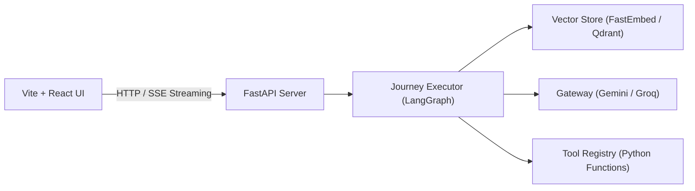
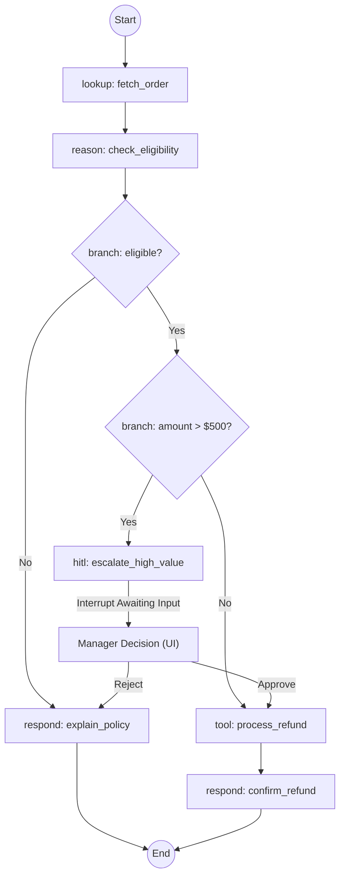

# System Architecture

FlowStrix decouples the developer interface (YAML / Natural Language) from execution, vector search, and API exposure. 

---

## 🔄 Request Flow & Decoupling

*   **Frontend (Vite + React):** A modern workspace UI showing active agent specs, execution traces, visual journey canvasses, real-time message streaming, and a dedicated **Human-in-the-Loop** panel for pending approvals.
*   **FastAPI API Server:** Exposes the engine endpoints. Supports traditional synchronous requests as well as real-time **Server-Sent Events (SSE)** for streaming step-by-step execution traces to the browser.
*   **Journey Executor:** Translates the YAML specifications into execution graphs. Compiles step definitions into runnable LangGraph nodes.
*   **Gateway Client:** Interacts with the LLMs using the OpenAI compatibility standard, allowing swapping between **Google Gemini (3.5-flash/pro)** and **Groq (llama-3.3-70b)** dynamically depending on the `.env` settings.

---

## ⚡ The Agent Primitives (Step Types)

Rather than treating the LLM as a single monolithic block, FlowStrix breaks actions down into discrete, specialized steps:

| Step Type | Execution Style | Primary Purpose | Examples |
|---|:---:|---|---|
| `lookup` | **Deterministic** | Ingest variables or query databases / APIs. | Fetching order lists, getting employee details |
| `reason` | **Probabilistic** | LLM evaluates current state, context, and RAG knowledge. Returns structured JSON. | Analyzing if request is within policy, checking eligibility |
| `branch` | **Deterministic** | Evaluates a boolean state expression to route execution. | Checking if `amount > 500` or `eligible == true` |
| `hitl` | **Deterministic** | Pauses execution, serializes state to thread memory, awaits human decision. | Escalating high-value refunds for manager sign-off |
| `tool` | **Deterministic** | Executes a state-modifying action (e.g. database updates, emails). | Writing a refund transaction, provisioning Slack access |
| `respond` | **Probabilistic** | LLM generates user-facing chat output matching the agent's persona. | Explaining policy rules, sending success confirmations |
| `wait` | **Deterministic** | Pauses execution for a duration or external callback event. | Awaiting vendor response |

---

## 🙋 Stateful Human-in-the-Loop Triage

Safety is critical when deploying agents in enterprise environments. FlowStrix handles this by treating state transitions as interrupt gates:

### Interrupt and Resume Pattern
1.  **State Checkpointing:** When execution hits a `hitl` node where the condition evaluates to `True`, the execution state is saved to thread storage (`MemorySaver` checkpointer in LangGraph).
2.  **SSE Interrupt Emit:** The backend yields an `interrupt` SSE frame containing the unique `execution_id` and the context to share (e.g., order value and customer history).
3.  **UI State Hydration:** The React frontend detects the interrupt, pauses the message stream, and displays the **Human Decision Panel**.
4.  **Resuming:** Upon clicking **Approve** or **Reject**, the API resumes the state machine thread, injecting the decision metadata directly back into the graph context to route execution downstream.
