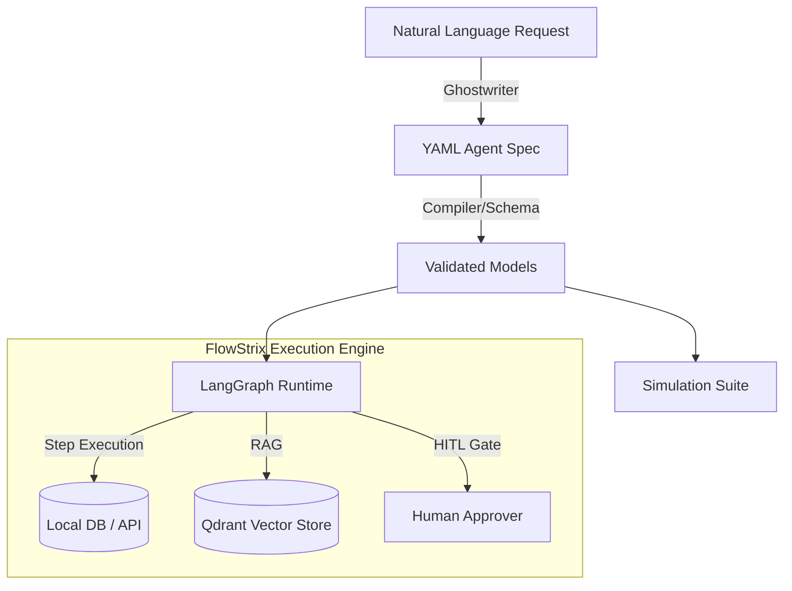

# FlowStrix — Agent-Native Workflow Engine

FlowStrix is an outcome-centric, agent-native workflow engine. It explores a fundamental architectural question: **"What would a low-code automation engine (like Salesforce Flow) look like if rebuilt from scratch today with AI agents as the core execution primitive instead of hardcoded step-by-step processes?"**

Designed to showcase modern agentic AI design patterns, FlowStrix bridges the gap between structured enterprise systems and non-deterministic LLM reasoning.

---

## 🚀 Key Value Proposition

Traditional workflow systems are **process-centric**—requiring developers to hand-draw and hardcode every conditional branch, API call, and fallback path. 

FlowStrix is **outcome-centric**. Developers declare the agent's **persona, tools, knowledge bases, and guardrails** using a structured YAML spec. The agent then dynamically reasons through the execution path to achieve the target goal, calling deterministic tools, checking real-time documentation, and self-correcting as needed.

> [!TIP]
> **Live Demo Setup:** You can launch the interactive FastAPI API + React UI stack locally by following the [Contributing & Setup Guides](testing.md).

---

## 🛠 Core Product Pillars

### 1. Low-Code Spec (YAML)
Human-readable, declarative definitions of agent behavior. Defines the agent's identity, allowed journeys, available tools, knowledge bases, and test scenarios.

### 2. Dual-Engine Execution (LangGraph)
Under the hood, FlowStrix uses **LangGraph** to build stateful multi-turn agent journeys. It supports:
*   **Deterministic Nodes:** Actions like database lookups, code branches, and API integration are fully deterministic and run instantly without touching the LLM.
*   **Probabilistic Nodes:** Complex reasoning, structured parameter extraction, and natural language communication run through state-of-the-art LLMs (Gemini / Groq).

### 3. Human-in-the-Loop (HITL) Gates
FlowStrix handles safety-critical operations (like executing a refund transaction or modifying configuration) via state machine interrupts. High-risk actions pause execution, checkpointing graph state, and resume instantly upon human approval.

### 4. Natural Language Compiler (Ghostwriter)
Using **Instructor**, developers can describe what they want an agent to do in plain English (e.g. *"Build an agent to handle IT access requests..."*). The Ghostwriter parses this and outputs a fully structured, validated, and executable YAML specification.

### 5. AI-Driven Testing (Simulator)
Ensures agent reliability before production. Executes journeys multiple times in sandbox mode and evaluates the outcomes using an LLM-as-a-judge to detect flakiness and logical regressions.

---

## 🗺 Where to Start

*   **[Architecture](architecture.md)** — Dive deep into request flows, LangGraph execution nodes, and LLM-as-a-judge patterns.
*   **[Repository Layout](repository-layout.md)** — Navigate the Python package and React frontend structure.
*   **[Testing & Simulations](testing.md)** — Run the simulation suites, tests, and start the local server.
